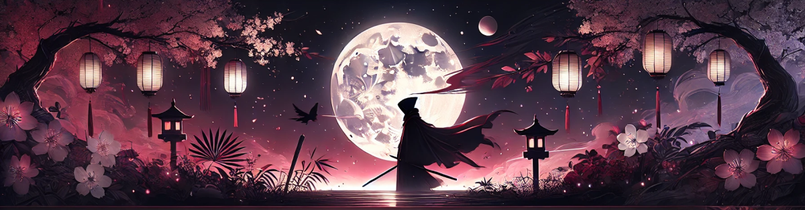

  

<h1 align="center">𝒪𝒹𝒶𝒾𝓈𝒽𝒾</h1>

  🌑 Night-coded. 🩸 Oni-forged. 👹 Pixel-bound.

---

### 🧠 About Me
- 🔥 Passionate developer, worldbuilder, and oni-inspired creator.
- 🛠️ Currently building **Atherra** a medieval fantasy roleplay Minecraft server.
- 💀 Fueled by shadows, cherry blossoms, and code.

---

### 🗡️ Arsenal & Credentials

**Tools of the Trade**  

**Forged Certifications**  
- 🛡️ Cisco **Certified Support Technician (CCST)**
- 🌐 Cisco **Introduction to IoT**
- 🐧 Cisco **Linux Unhatched**
- 🎨 Adobe **Certified Professional in Visual Design (Photoshop)**

---

### 📈 GitHub Stats

---

### 🌐 Find Me Elsewhere
- 📸 [Instagram](https://www.instagram.com/odaishi_/)
- 🌌 [Bluesky](https://bsky.app/profile/odaishi.aethro.net)
- ☕ [Ko-fi](https://ko-fi.com/odaishi)
- 🎮 [Twitch](https://www.twitch.tv/odaishi__)
- 🌸 [Portfolio](https://odaishi.carrd.co/)

---

  
   
  <i>"Even demons dream in code."</i>

